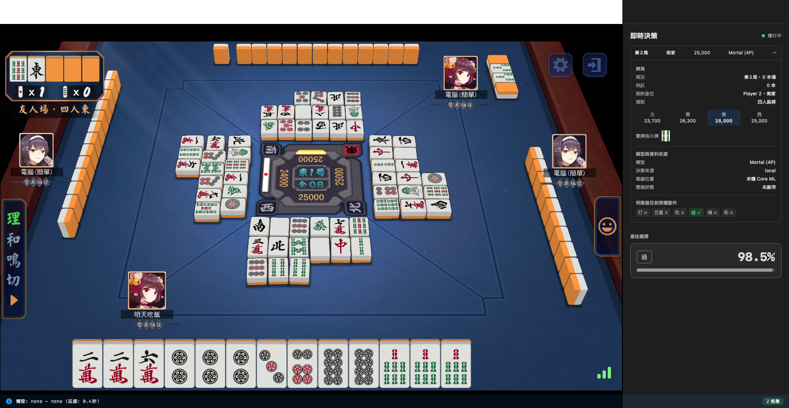
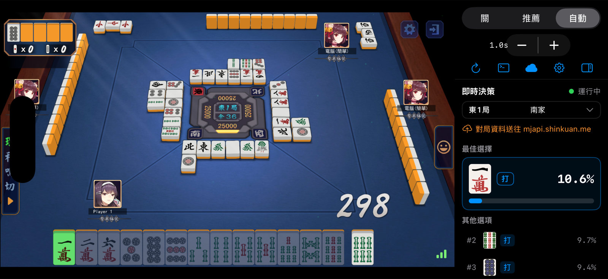
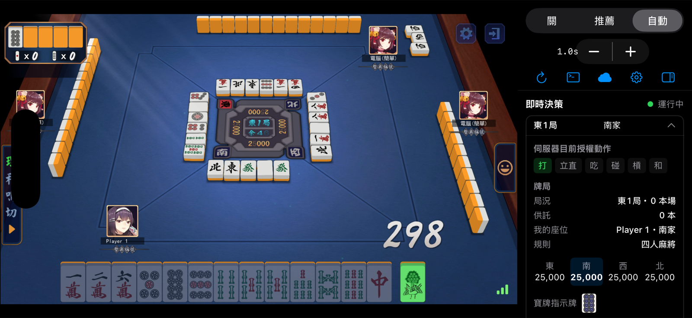
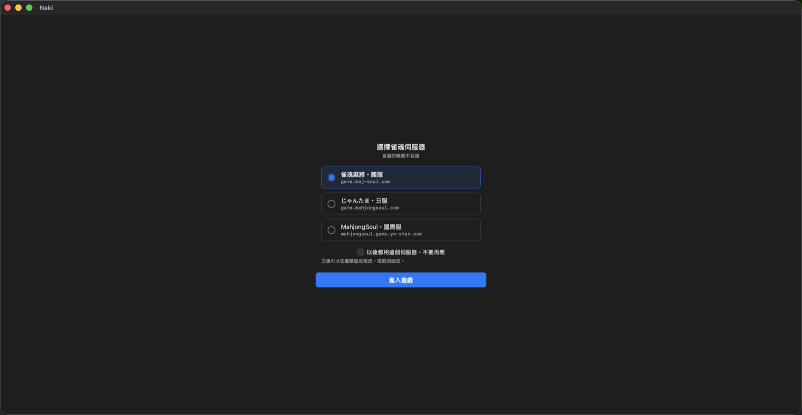
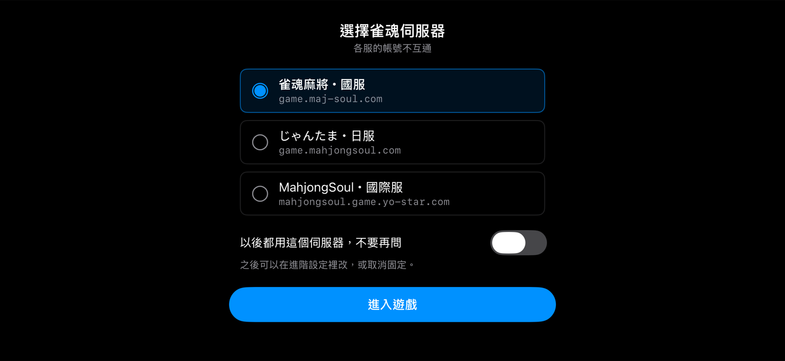
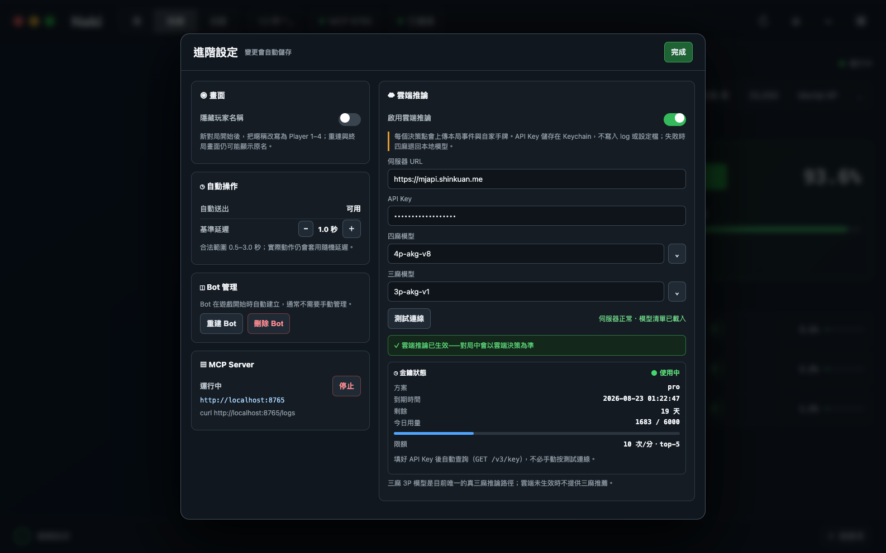
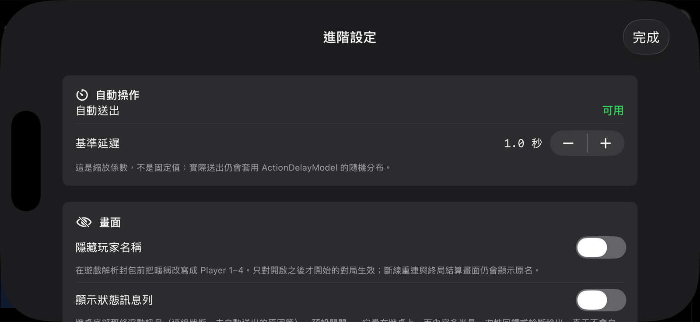
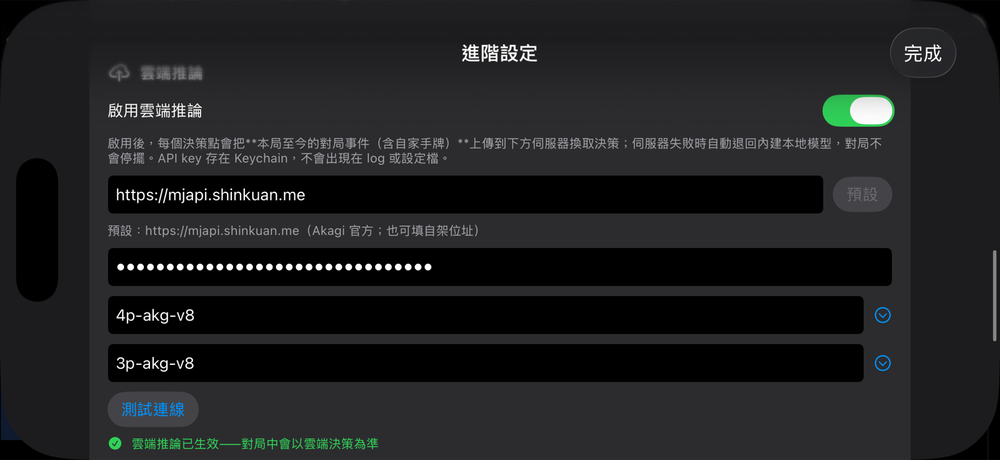

# Naki（鳴き）

**English** | [繁體中文](README.md)

**Your AI mahjong companion for Mahjong Soul. A native macOS and iOS app, with on-device inference by default.**

<p align="center">
  
</p>

<p align="center">
  <a href="https://github.com/Sunalamye/Naki/releases/latest"></a>
  
  
  
  <a href="LICENSE"></a>
</p>

<p align="center">
  <a href="https://github.com/Sunalamye/Naki/releases/latest"><b>Download</b></a> ·
  <a href="#quick-start"><b>Quick start</b></a> ·
  <a href="#features"><b>Features</b></a> ·
  <a href="#optional-cloud-inference"><b>Cloud inference</b></a> ·
  <a href="#for-developers"><b>For developers</b></a>
</p>

---

> [!WARNING]
> **For learning and research only.** Using Naki may violate Mahjong Soul's terms of service and may result in account suspension or a permanent ban.
>
> **Do not use your main account.** A secondary account is not exempt from these risks. The author is not responsible for losses arising from use of this software.

## What is Naki?

*Naki* (鳴き) is the Japanese mahjong term for calling tiles, such as chi, pon, and kan. When a call is worth considering, Naki helps you see your options.

Naki brings Mahjong Soul and a mahjong AI into one window. **No Python environment, Docker container, browser extension, or proxy server is required to use the app.** Open it, sign in, and view recommendations alongside the table, with suggested tiles highlighted in the game.

The local engine is based on [Mortal](https://github.com/Equim-chan/Mortal), running through Core ML on the Apple Neural Engine. **Local inference is the default:** model computation stays on your device and does not require an external inference service. Mahjong Soul itself still requires an internet connection.

Three-player mahjong is handled by a separate local engine: Akagi v3's three-player behavior-cloning model, at **default strength**. It imitates human Tenhou play and is **not Mortal-level**; see [About three-player mahjong](#about-three-player-mahjong).

You can optionally connect to an [Akagi](https://github.com/shinkuan/Akagi)-compatible inference server for stronger hosted models, including a true three-player model. Cloud inference is **off by default** and has different privacy and availability implications; see [Cloud inference](#optional-cloud-inference).

---

## Quick start

### Requirements

| Platform | Minimum OS | Hardware | Automatic actions |
|---|---|---|---|
| macOS | 26.0+ | Apple Silicon | Supported |
| iOS / iPadOS | 17.0+ | A12 or later | Supported on iOS / iPadOS 26+; recommendations only on 17–25 |

Intel Macs are not supported by the current app. Local inference targets the Apple Neural Engine.

> [!IMPORTANT]
> iOS 17–25 uses the legacy `WKWebView` backend. **It displays recommendations but does not automatically submit actions.** The newer `WebPage` backend is used on macOS and iOS 26+. The legacy path has not been validated through a complete match on a physical device; see [Current status](#current-status).

### Install

Download a build from [Releases](https://github.com/Sunalamye/Naki/releases/latest).

| Platform | File | Installation |
|---|---|---|
| macOS | `Naki.dmg` | Open the disk image and drag Naki into Applications. |
| macOS | `Naki.zip` | Extract the app and move it into Applications. |
| iPhone / iPad | `Naki-M.ipa` | Sign and sideload the IPA using your own signing setup. Follow the release notes for the build you download. |

The published macOS build is not notarized, and the IPA is unsigned. macOS may require approval in System Settings before the app can open. Only approve a build from a source you trust; see the release notes for installation details.

### Start a session

1. Open Naki and select your Mahjong Soul server: Chinese, Japanese, or International.
2. Sign in with a **secondary account**, after reading the account-risk warning above.
3. Select **Recommend** to keep manual control, or choose an automatic mode on a supported platform.
4. Start a match. The sidebar shows the preferred action, alternatives, and expandable round details.

Your mode selection is saved across launches. **On a fresh installation, Auto is the default on supported platforms**, so switch to Recommend before starting a match when you only want advice. Legacy iOS devices restrict the available modes to Off and Recommend.

---

## Features

<table>
<tr>
<td width="52%">

### Recommendations where you need them

Suggested tiles are highlighted on the table, while the sidebar explains the decision.

- Read from top to bottom: best choice → alternatives → expandable round details.
- Recognizable tile artwork, with separate assets for red fives.
- Action support includes discards, chi, pon, kan, riichi, wins, north extraction, and the nine-terminals abortive draw (not yet live-verified), subject to the game mode and server-authorized actions.

</td>
<td width="48%">

</td>
</tr>
<tr>
<td width="52%">

</td>
<td width="48%">

### A layout built around the table

- **Mac:** a decision sidebar, with automatic actions and between-round confirmation on supported modes.
- **iPhone / iPad:** a full-height table with controls and decisions in a persistent right-hand panel.
- Dark mode and responsive layouts.

On a landscape iPhone, vertical space is the constraint. The layout gives that height back to the table and uses the spare width beside Mahjong Soul's 16:9 view for the panel.

</td>
</tr>
<tr>
<td width="52%">

### Round details without the clutter

Expand the summary row to inspect server-authorized actions, player scores, dora indicators, and whether the current recommendation came from the local or cloud model. Collapse it back to a single row when you are done.

</td>
<td width="48%">

</td>
</tr>
</table>

<sub>The iPhone gameplay images were captured from the app running in an iOS 26 simulator. Player names are concealed using Naki's built-in name-hiding feature. The images retain the interface language used when they were captured.</sub>

### Choose your Mahjong Soul server

Naki supports the **Chinese, Japanese, and International** servers. By default, it asks which server to use at each launch. Accounts are separate across regions, so selecting the correct server matters for signing in.

Select the option to always use the chosen server to skip the prompt. You can change servers or restore the launch prompt in Advanced Settings.

<sub>Observation: all three servers run the same client (<code>version.json</code> reports <code>0.11.252.w</code> on each), so the protocol is identical and Naki needs no per-server parsing.</sub>

<table>
<tr>
<td width="50%">

</td>
<td width="50%">

</td>
</tr>
</table>

### Control how Naki assists you

| Mode | Behavior |
|---|---|
| **Off** | Hides recommendations and clears in-game highlights. No automatic actions are submitted. Inference continues in the background so recommendations can resume when you switch modes. |
| **Recommend** | Shows suggestions; you decide which actions to take. |
| **Auto** | Automatically submits actions through the decision and legality checks, and confirms the transition to the next round. |
| **Full Auto** | Adds automatic matchmaking for another match after the current match ends. Unlike Auto, this mode also authorizes starting the next match. |

Auto and Full Auto are available only on platforms that support automatic actions. The current mode definitions and platform restrictions are in [`AutoPlayMode.swift`](command/Services/Bot/AutoPlayMode.swift).

The toolbar also offers a **delay baseline** control, from 0.5 to 3.0 seconds. This scales a randomized action-delay distribution; it does not set a fixed delay for every action. A value of 1.0 seconds uses the baseline behavior, with higher values slowing it down and lower values speeding it up.

### Other tools

- **Hide player names:** an Advanced Settings switch that works on two layers. Protocol-level rewriting replaces names with `Player 1`–`Player 4` before the game parses packets, and applies only to matches started after enabling the option. Render-level hiding (added in 2.8.0) takes effect the moment you switch it on. The Unity client has no hookable UI layer, so Naki calibrates itself: it tries masking candidates one at a time, compares the screen, and picks the one whose masking changes all four seat positions with very few changed pixels. If it cannot identify one, it hides nothing rather than hiding unrelated UI. This is a display feature, not a guarantee of anonymity.
- **Protocol-level emotes:** MCP tools can send emotes and inspect received broadcasts. The older automatic-reply path is not available with the Unity client.
- **MCP integration:** connect an AI assistant such as Claude Code to inspect state and use the app's exposed tools.
- **Local Debug API:** the HTTP server binds to loopback, not to other devices on your network.

---

## Optional cloud inference

Open **Advanced Settings → Cloud Inference** and supply your own API key. The default endpoint is Akagi's `mjapi.shinkuan.me`; an Akagi-compatible self-hosted endpoint can also be configured.

> [!IMPORTANT]
> **Enabling cloud inference sends the current round's accumulated game events, including your own hand, to the configured inference server at decision points.** It is not a local-only mode. The sidebar keeps the destination host visible while cloud inference is active.

| Area | Behavior |
|---|---|
| Opt-in | Disabled by default. Obtain your own key; the app does not include a purchase or redemption flow. |
| Key storage | Stored in Keychain. Logs show only the last four characters of the key. |
| Local fallback | The local model stays loaded throughout. Timeouts, rate limits, or connection failures fall back to local decisions, with an exponential-backoff circuit breaker from 5 to 120 seconds, so the match never stalls. Three-player matches fall back to the local Akagi three-player engine. |
| Decision source | The sidebar and `/bot/status` identify the effective source as `local` or `cloud:<model>`. |
| Failure visibility | The sidebar turns into a red warning ("Cloud failed — using the local model", with the consecutive-hand count and automatic retry) so degradation is not left to a small hint. The API exposes `cloudDegraded` and `cloudFallbackStreak`. |
| Key status | After a key is entered, settings query `/v3/key` to show the plan, expiry, remaining days, and daily usage. |
| Model selection | Test Connection checks the endpoint and key, and lists the models available to the plan, including three-player (3p) models, selectable from the dropdown next to the model field. |
| Live changes | The toolbar has a cloud switch that can return to local decisions at any time; its icon reflects the effective state (active, enabled but missing a prerequisite, or off). Changes to the key or model take effect without restarting the match. |

### Settings on Mac and iPhone

<p align="center">
  
</p>

Mac settings use two columns: device and automation settings on the left, cloud inference on the right. Key status appears after a key is entered, without requiring Test Connection.

<sub>The macOS settings image is a design reference from <code>docs/ui-reference/</code>, not a screenshot of a fully rendered live settings sheet. The in-app screenshot API has limitations when capturing sheets; see the comments on <code>CaptureScreenshotAction.windowScreenshot</code>.</sub>

On iPhone, the same form uses a single-column layout:

<table>
<tr>
<td width="50%">

</td>
<td width="50%">

</td>
</tr>
</table>

The floating status message bar at the bottom of the table is **off by default**. It is intended for transient feedback and diagnostics. Persistent errors use a top banner and are not hidden by this setting.

For optional macOS notifications about cloud failures, reconnects, or stalled action submission, see [`scripts/cloud-watch.sh`](scripts/cloud-watch.sh), which watches the event log in the background and posts macOS notifications. Cloud implementation and verification notes are tracked in [`AUDIT.md`](AUDIT.md) §20 and [`docs/cloud-inference-plan.md`](docs/cloud-inference-plan.md).

---

## For developers

<details>
<summary><b>Architecture: protocol-driven, not screen-coordinate automation</b></summary>

```text
Mahjong Soul · Unity WebGL
          │
          │ WebSocket traffic / WebGL highlighting
          ▼
JavaScript bridge · naki-core / naki-websocket
          │
          ▼
Swift services
  MajsoulBridge → NativeBotController → LiqiActionSender
   Liqi → MJAI     Swift + Core ML       Protobuf actions
          │
  AutoPlayEngine → AutoPlayDecisionResolver
   Gates / delay     Legality / mode checks
          │
          ▼
GameStore ↔ SwiftUI views / MCP tools
```

The Unity WebGL client keeps game logic in WebAssembly rather than exposing the old JavaScript game objects. Naki therefore reads state from WebSocket messages and constructs protocol messages for actions. Protocol field definitions come from the game's published `res/proto/liqi.json` resource.

Tile highlighting hooks WebGL draw calls, identifies tile types from atlas UV coordinates, and temporarily changes draw colors. It does not depend on fixed screen coordinates. The hook is implemented, but screenshot-regression coverage has not established correct targeting for every tile and button.

**The server's available-action list, not the model, determines action legality.** The decision resolver fails closed when that list is missing and gives server-authorized wins priority over model suggestions.

Two earlier integration gaps are closed at the source level: an empty recommendation could keep a self-draw win from reaching the resolver, and a failed hora send was marked as handled. Now `AutoPlayGate` takes the forced-win path when the recommendation is empty but the available-action list contains a win, and an action is marked handled only after the send succeeds. Injected fixtures cover both. **The adversarial live fixture required by the project's `CLAUDE.md` (server `[1,7,8]`, AI wants to discard, the resolver overrides it to a win, then RESPONSE and `ActionHule`) has still not been reproduced live, so Naki does not claim that missed self-draw wins are fully eliminated.**

The legacy iOS 17–25 backend uses the same resolver, also without physical-device validation, and disables automatic action submission pending validation.

Further reading: [`docs/majsoul-unity-protocol.md`](docs/majsoul-unity-protocol.md), [`docs/architecture-deep-dive.md`](docs/architecture-deep-dive.md), and [`AUDIT.md`](AUDIT.md).

</details>

<details>
<summary><b>Debug API: local HTTP server on port 8765</b></summary>

The HTTP server uses the loopback interface (`127.0.0.1` / `::1`). Treat it as trusted local developer tooling, especially endpoints that execute JavaScript or submit game actions.

```bash
# Bot state, hand, and recommendations
curl http://localhost:8765/bot/status

# Actions currently allowed by the game protocol
curl http://localhost:8765/bot/ops

# Manually trigger an automatic-play cycle; this can submit a game action
curl -X POST http://localhost:8765/bot/trigger

# Open a given screen and switch language (DEBUG builds only; not in Release)
curl -X POST http://localhost:8765/debug/ui -d '{"screen":"settings","language":"en"}'

# Execute JavaScript in the game page; use return to retrieve a value
curl -X POST http://localhost:8765/js -d 'return window.location.href'
```

`/status` reports the log path. Full log directories are retained for the eight most recent launches; older directories retain only game recordings under `games/`.

</details>

<details>
<summary><b>MCP server: connect Claude Code or another MCP client</b></summary>

The built-in [Model Context Protocol](https://modelcontextprotocol.io/) server shares port 8765 with the Debug API. The protocol is **2026-07-28 (stateless)** and remains compatible with the older `initialize` handshake. Tool results use `structuredContent` rather than JSON wrapped in a JSON string, and non-loopback Origin requests receive 403.

```bash
claude mcp add --transport http naki http://localhost:8765/mcp
```

Discover the current tool inventory with `tools/list` or inspect `get_status.toolsCount`; a static count can become outdated as tools change (2.7.0 registered 40 tools statically, and six obsolete highlight stubs have since been removed).

| Area | Count | Example tools |
|---|:---:|---|
| System | 6 | `get_status`, `get_logs`, `replay_game` |
| Bot control | 7 | `bot_status`, `bot_ops`, `bot_trigger` |
| Game state and actions | 8 | `game_state`, `game_action`, `game_confirm_new_round` |
| Lobby | 8 | `lobby_start_match`, `lobby_account_info` |
| Friendly rooms | 7 | `room_create`, `room_add_robot`, `room_quick_test` |
| Emotes | 2 | `game_emoji`, `game_emoji_listen` |
| Utilities | 2 | `execute_js`, `lobby_anti_idle` |

`room_quick_test` creates a room, adds bots, and starts a test match. It does **not** validate reconnection, AI decisions, server responses, or authoritative game actions by itself.

`game_vote_game_end` is a destructive operation that votes to end a match. It is exposed for manual invocation only and is not part of an automatic workflow.

</details>

<details>
<summary><b>Build from source</b></summary>

Requires **Xcode 26 or later**.

```bash
git clone https://github.com/Sunalamye/Naki.git
cd Naki

# Build the macOS app
xcodebuild build -project Naki.xcodeproj -scheme Naki

# Run the macOS unit-test target
xcodebuild test -project Naki.xcodeproj -scheme Naki -only-testing:NakiTests
```

Use a **Release build for actual gameplay**. Core ML and expected-value calculations are affected by optimization settings; no fixed latency claim is made here.

```bash
xcodebuild build -project Naki.xcodeproj -scheme Naki -configuration Release
```

In Xcode, the run configuration is under **Product → Scheme → Edit Scheme → Run → Build Configuration**. Device builds also require your own signing configuration.

</details>

---

## Current status

Feature availability is not the same as complete end-to-end verification. [`AUDIT.md`](AUDIT.md) records the evidence and remaining gaps in more detail.

| Feature | Status / limitation |
|---|---|
| Four-player AI recommendations | Available with the local model. |
| Automatic play and between-round confirmation | Available on macOS / iOS 26+; live validation gaps remain. |
| Full Auto rematching | Implemented as a separate opt-in mode from Auto. |
| In-game tile highlighting | Implemented; complete visual-regression coverage is still missing. |
| Optional cloud inference | Available, with explicit upload disclosure and local fallback. Live-verified for four-player matches; no live three-player match with a cloud model. |
| Three-player AI recommendations | Available locally at default strength; see below. |
| Hide player names | Protocol-level rewriting and render-level hiding. |
| MCP server and Debug API | Available through the local loopback server. |
| iOS 17–25 | Recommendations only; automatic action submission is disabled. |
| Game-record review and analysis | Not yet implemented as a user-facing analysis workflow. |

### About three-player mahjong

**Three-player mahjong uses a separate local engine and does not borrow the four-player model.** The bundled four-player Mortal model is not used for three-player matches, because the observation layouts differ and the result would be structurally invalid. Three-player matches run on `AkagiSanma`, a pure-Swift port inside [MortalSwift](https://github.com/Sunalamye/MortalSwift) 0.6.0 of Akagi v3's three-player behavior-cloning model (Apache 2.0; 37×27 observation, 60 actions).

- **Strength is default strength.** It imitates human Tenhou play and is **not Mortal-level**, so do not compare it with four-player recommendations. The sidebar labels the model name accordingly.
- With cloud inference enabled, the cloud is tried first, and the local engine decides only when the cloud times out or fails. With it disabled, the local engine decides. Only if the engine fails to build does Naki fall back to cloud-only.
- Legal actions are authorized by the server's available-action list. A win is judged by tile shape only, and the server decides the yaku. If the list is missing, only discard and pass remain.
- Three-player friendly rooms need three-player rules (2 red fives, 35000 start, 40000 return), otherwise the server answers error 1112. `room_quick_test` with `player_count=3` supplies them automatically.
- North extraction: a freshly drawn north tile carries `moqie`. On disconnect, Naki stops immediately, marks the stall, and retries with backoff until reconnection.

**Live verification (2026-10-09, three matches against bots):** the local engine's decisions, riichi, wins, pon, and north extraction (11 of 11, including a freshly drawn north) form a complete chain. **Not yet verified:** backoff and stall display after being kicked offline, an occasional resend on the dealer's first discard (three occurrences, cause unknown), and physical iOS devices. See [`AUDIT.md`](AUDIT.md) and [`sanma-implementation-notes.md`](sanma-implementation-notes.md).

---

## Acknowledgments

- [Mortal](https://github.com/Equim-chan/Mortal) — mahjong AI engine and libriichi.
- [Akagi](https://github.com/shinkuan/Akagi) — reference implementation, optional cloud inference server, and the `/v3` protocol. The local three-player engine uses the behavior-cloning weights from its v3 branch and ported tile / observation / action logic (Apache 2.0; the full license text ships as `Sources/AkagiSanma/LICENSE-Akagi.txt` in MortalSwift).
- [RiichiEnv](https://github.com/smly/RiichiEnv) (`riichienv-core`) — reference implementation for three-player state and legal-action enumeration, which Akagi's three-player engine depends on; same license notice as above.
- [riichi-mahjong-tiles](https://github.com/FluffyStuff/riichi-mahjong-tiles) by FluffyStuff — tile artwork used in the sidebar, released under CC0 1.0.
- Mahjong Soul (Majsoul) — the mahjong game Naki integrates with.

### Tile artwork

The sidebar uses 40 SVG assets from FluffyStuff's tile set: 27 numbered tiles, 3 red fives, 7 honor tiles, and 3 additional assets such as tile backs.

These replace the earlier Unicode mahjong characters (`🀇🀙🀐`). System fonts draw them as black-and-white line art, so at recommendation-row size you had to recognize the glyph before matching it to a tile on the table. They also **cannot represent red fives**: `5mr` and `5m` are the same code point, so the only option was tinting the whole tile red. With image assets, red fives are separate assets. Asset names follow the same MJAI convention as `Tile.mjaiString`, including `5mr`, `5pr`, and `5sr`.

Import notes and the asset mapping are documented in [`docs/third-party/riichi-mahjong-tiles.md`](docs/third-party/riichi-mahjong-tiles.md). Attribution is included for traceability, even though CC0 does not require it.

## License

The repository specifies **[AGPL-3.0 with Commons Clause](LICENSE)**. The additional Commons Clause restricts selling the software as defined in that license condition. Read the repository's license before using or redistributing it; it is not an unrestricted AGPL-only grant.

## Disclaimer

**Purpose.** This project is intended for learning and research in Swift / SwiftUI development, Core ML integration, and WebSocket / Protobuf protocol handling.

**Account risk.** Use may violate Mahjong Soul's terms of service and may result in suspension or a permanent ban. Do not use your main account. No account or operating mode is guaranteed to avoid enforcement.

**Your responsibility.** You are responsible for checking the applicable game rules, terms, and local legal requirements before use.

**No warranty.** The software is provided “as is,” without express or implied warranties. The author accepts no responsibility for claims, damages, or other liabilities arising from its use.

**No affiliation.** Naki is an independent project and is not affiliated with or endorsed by Mahjong Soul, Catfood Studio, or Yostar. Third-party names and assets belong to their respective owners.

By using this software, you acknowledge the risks and the applicable license terms.

---

<p align="center">
  <a href="https://star-history.com/#Sunalamye/Naki&Date">
    
  </a>
</p>
