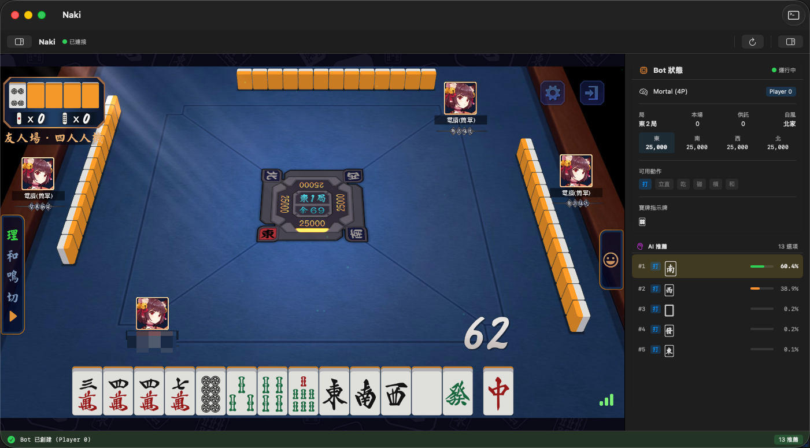
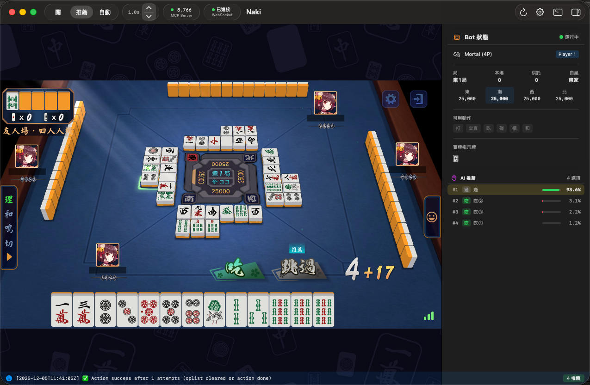
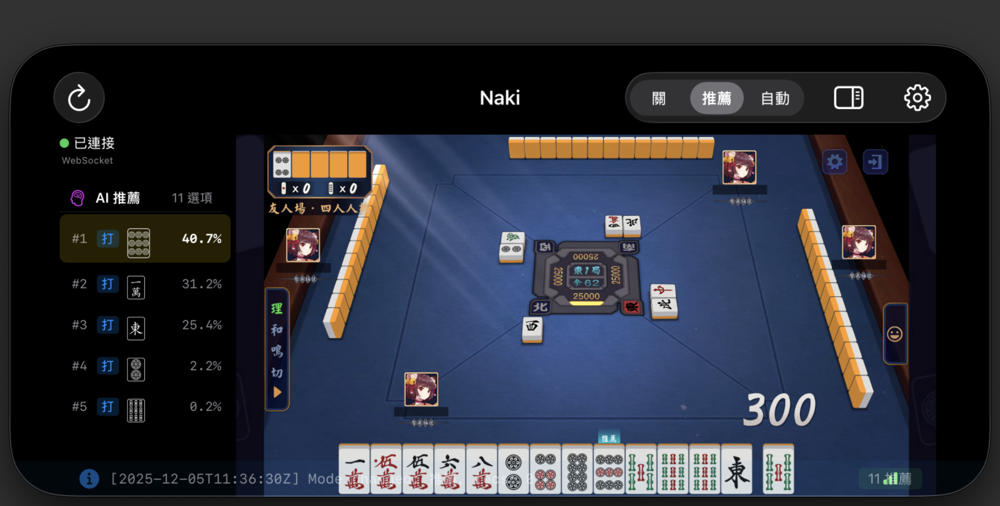

# Naki (鳴き) - 你的雀魂 AI 雀友

<p align="center">
  
</p>

<p align="center">
  
  
  
  
  
</p>

<p align="center">
  <a href="https://github.com/Sunalamye/Naki/releases/latest"><strong>📥 立即下載</strong></a> ·
  <a href="#-快速開始"><strong>🚀 快速開始</strong></a> ·
  <a href="#-功能展示"><strong>✨ 功能展示</strong></a>
</p>

---

## ⚠️ 使用前必讀

> **本專案僅供學習與研究用途！**
>
> - 🚫 **請勿使用主帳號** — 強烈建議使用小號或測試帳號
> - ⚖️ 使用本工具可能違反雀魂服務條款，可能導致帳號被封禁
> - 🙅 作者不對任何因使用本工具造成的損失負責
>
> **繼續使用即表示您已理解並接受以上風險。**

---

> **鳴き (Naki)** — 日麻術語，指「吃」「碰」「槓」等副露動作。
>
> 這款 AI 會在關鍵時刻告訴你：**該鳴！**

## 這是什麼？

Naki 是一款**原生 Apple 應用**，內建雀魂遊戲和 AI 助手。

**不需要** Python、Docker、瀏覽器外掛，開箱即用。

## ✨ 功能展示

<table>
<tr>
<td width="50%">

### 🎯 即時 AI 推薦

每張牌都有 AI 評分，最佳選擇會直接在遊戲中高亮顯示。

- 顏色越亮 = 越推薦
- 側邊欄顯示完整分析
- 支援吃/碰/槓/立直/和牌推薦

</td>
<td width="50%">



</td>
</tr>
<tr>
<td width="50%">



</td>
<td width="50%">

### 📱 跨平台支援

macOS 和 iOS 都能用！

- macOS：完整功能，含自動打牌
- iOS/iPhone：查看 AI 推薦
- 響應式 UI，深色模式支援

</td>
</tr>
</table>

### 🤖 三種模式任你選

| 模式 | 說明 |
|:---:|-----|
| **關閉** | AI 背景運算但不顯示，完全手動 |
| **推薦** | 顯示 AI 推薦，你來決定怎麼打 |
| **自動** | AI 全權代理，躺平看戲 |

### 🎮 更多功能

- **手牌顏色高亮** — AI 推薦的牌直接在遊戲畫面中標色
- **動作按鈕高亮** — 吃/碰/槓/立直按鈕也會高亮提示
- **自動回應表情** — 被立直、被和牌時自動發表情
- **隱藏玩家名稱** — 保護隱私，錄影時更安心
- **MCP Server** — 讓 Claude Code 等 AI 助手直接操作遊戲

## 🚀 快速開始

### 系統需求

| 平台 | 最低版本 | 架構 |
|-----|---------|-----|
| **macOS** | 26.0+ (Tahoe) | Apple Silicon (M1/M2/M3/M4) |
| **iOS** | 26.0+ | A12+ / Apple Silicon |

> **為什麼不支援 Intel Mac？**
> AI 模型使用 Apple Neural Engine 加速運算，這是 Apple Silicon 獨有的硬體。

### 下載安裝

1. 前往 [Releases](https://github.com/Sunalamye/Naki/releases/latest) 下載 `Naki.dmg`
2. 拖入 Applications 資料夾
3. 首次開啟：右鍵 → 打開（繞過 Gatekeeper）

### 開始使用

1. 打開 Naki，雀魂會自動載入
2. 登入你的帳號（**建議使用小號**）
3. 開始對局，AI 推薦會即時顯示
4. 在側邊欄選擇你想要的模式

## 🔧 進階功能

<details>
<summary><b>🛠 Debug API (HTTP Server)</b></summary>

應用啟動後會開啟 HTTP Server (port 8765)：

```bash
# 查看 Bot 狀態
curl http://localhost:8765/bot/status

# 手動觸發打牌
curl -X POST http://localhost:8765/bot/trigger

# 執行 JavaScript
curl -X POST http://localhost:8765/js -d 'return window.location.href'
```

</details>

<details>
<summary><b>🤖 MCP Server (Claude Code 整合)</b></summary>

Naki 支援 [Model Context Protocol](https://modelcontextprotocol.io/)，提供 47 個工具讓 AI 助手直接操作遊戲。

**配置 Claude Code：**
```bash
claude mcp add --transport http naki http://localhost:8765/mcp
```

**主要工具分類：**

| 類別 | 工具範例 |
|-----|---------|
| Bot 控制 | `bot_status`, `bot_trigger`, `bot_sync` |
| 遊戲操作 | `game_state`, `game_discard`, `game_action` |
| 大廳控制 | `lobby_start_match`, `lobby_cancel_match` |
| UI 控制 | `ui_names_hide`, `execute_js` |
| 表情系統 | `game_emoji`, `game_emoji_list` |

詳見 [MCP Server 指南](docs/mcp-server-guide.md)

</details>

<details>
<summary><b>🏗 架構設計</b></summary>

```
┌─────────────────────────────────────────────────────────┐
│                  WebPage (雀魂遊戲)                      │
│                         │                               │
│              JavaScript 攔截模組                         │
│     naki-core / naki-websocket / naki-autoplay         │
└─────────────────────────┼───────────────────────────────┘
                          ▼
┌─────────────────────────────────────────────────────────┐
│                   Swift 服務層                           │
│                                                         │
│   MajsoulBridge → NativeBotController → AutoPlayService│
│   (Liqi→MJAI)    (Rust FFI + Core ML)   (自動打牌)      │
│                         │                               │
│         GameStateManager ← → SwiftUI Views             │
│          (@Observable)       (響應式 UI)                │
└─────────────────────────────────────────────────────────┘
```

**核心技術：**
- **協議轉換**：Liqi Protobuf → MJAI JSON
- **AI 推論**：Core ML + Mortal 神經網絡
- **狀態管理**：Swift @Observable 響應式架構

</details>

## 📋 開發計畫

- [x] AI 推薦高亮
- [x] 全自動打牌
- [x] 動作按鈕推薦
- [x] MCP Server 支援
- [x] 手牌顏色高亮
- [x] 自動回應表情
- [ ] 三麻模式
- [ ] 牌譜回放分析

## 🙏 致謝

- [Mortal](https://github.com/Equim-chan/Mortal) — 強大的麻將 AI 引擎
- [Akagi](https://github.com/shinkuan/Akagi) — Python 版參考實現
- 雀魂 (Majsoul) — 優秀的麻將遊戲平台

## 📄 許可證

[AGPL-3.0 with Commons Clause](LICENSE) — 開源但禁止商業銷售

---

## ⚖️ 免責聲明

### 教育與學習目的

本專案的開發目的是為了：
- 學習 Swift/SwiftUI 原生 macOS/iOS 應用開發
- 研究 Core ML 機器學習模型整合
- 理解 WebSocket 通訊協議與攔截技術
- 探索 Protobuf 協議解析

### 使用風險

1. **帳號風險**：使用本工具可能違反雀魂 (Majsoul) 的服務條款，可能導致您的遊戲帳號被暫停或永久封禁。**強烈建議使用小號或測試帳號**。

2. **法律風險**：在某些地區，使用此類工具可能涉及法律問題。請確保您了解並遵守當地法律法規。

3. **無擔保**：本軟體按「現狀」提供，不提供任何明示或暗示的擔保，包括但不限於對適銷性、特定用途適用性和非侵權性的擔保。

### 責任限制

在任何情況下，作者或版權持有人均不對任何索賠、損害或其他責任負責，無論是在合約訴訟、侵權行為或其他方面，由軟體或軟體的使用或其他交易引起或與之相關。

### 第三方內容

- 本專案使用 [Mortal](https://github.com/Equim-chan/Mortal) AI 模型
- 雀魂 (Majsoul) 是貓糧工作室的註冊商標
- 本專案與貓糧工作室或悠星網絡無任何關聯

**使用本軟體即表示您已閱讀、理解並同意以上所有條款。**

---

<p align="center">
  <sub>Made with ❤️ by a Mahjong lover who got tired of losing</sub>
</p>
