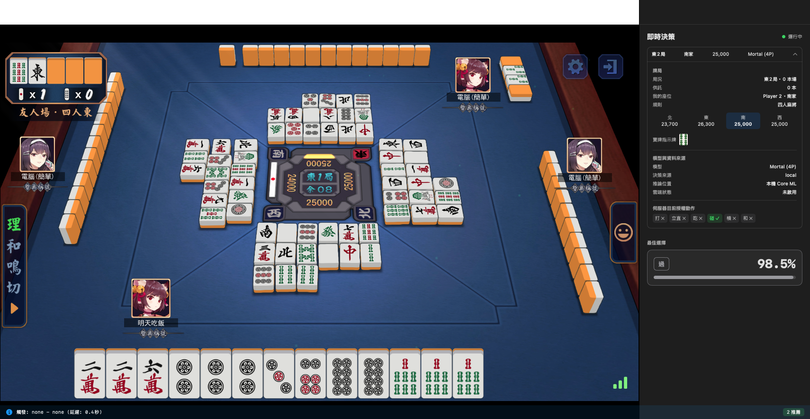
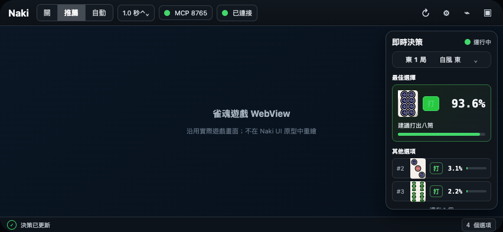
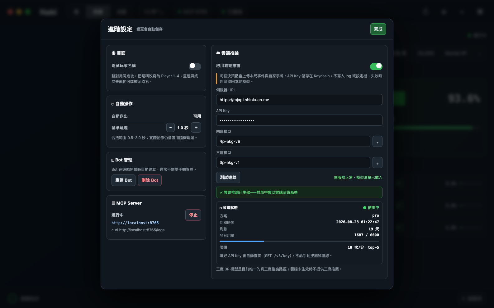

# Naki（鳴き）

**雀魂的 AI 雀友。原生 macOS / iOS 應用，打開就能用。**

<p align="center">
  
</p>

<p align="center">
  
  
  
  
  
</p>

<p align="center">
  <a href="https://github.com/Sunalamye/Naki/releases/latest"><b>下載</b></a> ·
  <a href="#快速開始"><b>快速開始</b></a> ·
  <a href="#能做什麼"><b>能做什麼</b></a> ·
  <a href="#給開發者"><b>給開發者</b></a>
</p>

---

> ## ⚠️ 先讀這段
>
> 本專案**僅供學習與研究**。使用它可能違反雀魂服務條款，導致帳號被封禁。
>
> **請勿使用主帳號。** 作者不對任何損失負責。繼續使用即代表你接受這個風險。

---

## 這是什麼

「鳴き」是日麻術語，指吃、碰、槓那類副露動作。這個 App 會在該鳴的時候告訴你：該鳴。

Naki 把雀魂和麻將 AI 裝進同一個視窗。**不需要 Python、Docker、瀏覽器外掛或代理伺服器**——
下載、打開、登入，AI 推薦就直接疊在遊戲畫面上。

推論引擎是 [Mortal](https://github.com/Equim-chan/Mortal)，透過 Core ML 跑在 Apple Neural Engine 上——
**預設**模型和運算都在本機，不呼叫外部推論服務；雀魂遊戲本身仍需要網路連線。

另可**選配**接上 [Akagi](https://github.com/shinkuan/Akagi) 的雲端推論伺服器，
用更強的託管模型（含真三麻模型）做決策；預設關閉，詳見下方〈雲端推論〉。

---

## 能做什麼

<table>
<tr>
<td width="52%">

### 推薦直接標在牌上

不用低頭看側邊欄再回頭找牌。AI 建議會標在遊戲畫面上，側欄同時給出完整分析。

- 側欄由上到下就是決策順序：最佳選擇 → 其他選項 → 牌局細節（可收合）
- 牌面用真實牌圖，赤五有自己的圖
- 涵蓋打牌 / 吃 / 碰 / 槓 / 立直 / 和牌 / 拔北 / 九種九牌

</td>
<td width="48%">

</td>
</tr>
<tr>
<td width="52%">

</td>
<td width="48%">

### Mac 和 iPhone 都能用

- **macOS** — 決策側欄，支援自動送出與局間自動確認
- **iPhone / iPad** — 決策浮在牌桌上方的 HUD，不從遊戲畫面切走寬度
- 深色模式、響應式排版

<sub>iPhone 圖為設計稿（`docs/ui-reference/`），非實機截圖。</sub>

</td>
</tr>
</table>

### 三種模式，隨時切換

| 模式 | 行為 |
|:---:|-----|
| **關閉** | 不自動送動作，也不顯示推薦（側欄顯示「推薦顯示已關閉」，遊戲內高亮清空）；AI 仍在背景計算，切回來立刻有結果 |
| **推薦** | 顯示建議，你自己決定 |
| **自動** | 依 AI／server oplist 自動送出，並在局間結算自動確認進下一局（`confirmNewRound`），整局不需手動點 |

模式會記住，重開 App 不會被重設。工具列還有一個**延遲基準** stepper（0.5–3.0s）：
它是擬人延遲隨機分布的縮放係數（1.0s＝現行行為，向上更慢、向下更快），
不會把節奏變成固定值（固定節奏容易被偵測）。

### 雲端推論（可選）

進階設定 →「雲端推論」：貼上 API key 之後，每個決策點會把**本局至今的
對局事件（含自家手牌）**上傳到推論伺服器（預設 Akagi 官方
`mjapi.shinkuan.me`，也可自架），換取更強模型的決策。

- **預設關閉**，關著時行為與純本機版完全相同。key 自行取得
  （App 刻意不含購買／兌換流程），存於 **Keychain**，log 只出現後四碼
- 本機模型全程在場：伺服器逾時、限流、斷線時**自動退回本地決策**
  （指數退避斷路器 5s→120s），對局不會停擺；每一手的決策來源
  （`local` / `cloud:<模型>`）在側欄與 `/bot/status` 如實標示
- 啟用期間側欄**常駐顯示「對局資料送往 \<host\>」**——上傳的是牌局事件，
  要不要接受請自行斟酌
- **失敗時側欄轉成紅色警示**：「雲端失敗——正在用本地模型（連續 N 手，
  自動重試中）」。退化中不能只靠一個小字讓你自己發現，所以連續手數也一起顯示；
  `/bot/status` 另有 `cloudDegraded`／`cloudFallbackStreak` 兩個機讀欄位
- **金鑰狀態自動查詢**：填好 key 之後，設定頁會自動打 `/v3/key` 顯示
  **方案、到期時間、剩餘天數、今日用量**（`1683 / 6000` 這種），不必手動按測試。
  key 打錯的話那裡會直接說讀不到——不用等整局打完才發現一直在用本地模型
- 「測試連線」按鈕仍在，會驗證伺服器與 key，並列出你的方案可用的模型
  （含三麻 3p 模型），模型欄旁的下拉直接選
- 工具列有**雲端開關**，對局中可隨時切回本地；圖示反映的是實際生效狀態
  （生效／開了但缺條件／已關閉三種各有不同圖示）
- 局中改 key／換模型即時生效，不用重開對局
- `scripts/cloud-watch.sh`（選用）在背景監看 event log，脫節／失敗／
  watchdog 重連／送出停滯會**發 macOS 通知**——不必自己盯 log

<p align="center">
  
</p>

進階設定分兩欄：左邊是這台機器怎麼跑（畫面、自動操作、Bot、MCP Server），
右邊是雲端推論。金鑰狀態在填好 key 之後自動出現，不必按測試連線。

<sub>設定頁圖為設計稿（`docs/ui-reference/`）。App 內的截圖 API 抓不到 sheet 的完整渲染，
見 `CaptureScreenshotAction.windowScreenshot` 的註解。</sub>

雲端相關的驗證進度記在 [`AUDIT.md`](AUDIT.md) §20 與
[`docs/cloud-inference-plan.md`](docs/cloud-inference-plan.md)。

### 其他

- **協定層表情工具** — MCP 可發送表情並讀取收到的廣播；舊自動回覆路徑在 Unity 下不可用
- **隱藏玩家名稱** — 進階設定裡的開關，兩層一起生效：
  - **協定層** 在遊戲解析封包之前把暱稱改寫成 `Player 1`–`Player 4`。只對開啟之後才開始的
    對局生效
  - **渲染層**（2.8.0 新增）直接讓遊戲畫面上的名字不顯示，**開關當下就生效**，不必等下一局。
    Unity 客戶端沒有可 hook 的 UI 層，所以靠自我校準認出名字那一層：開啟時逐一試遮並比對
    畫面，選出「遮掉會讓四家位置同時變化、但變動像素很少」的那一個。認不出來就什麼都不遮，
    不會誤遮其他 UI
- **MCP Server** — 讓 Claude Code 之類的 AI 助手直接操作遊戲
- **本機 Debug API** — 只綁 loopback，同網段的其他裝置連不到

---

## 快速開始

### 系統需求

| 平台 | 版本 | 架構 |
|-----|------|-----|
| **macOS** | **26.0+** | Apple Silicon |
| **iOS / iPadOS** | 17.0+ | A12 以上 |

> **為什麼要 Apple Silicon？**
> AI 模型跑在 Apple Neural Engine 上，那是 Apple Silicon 獨有的硬體，Intel Mac 沒有。

> **iOS 17–25** 走 `WKWebView` Legacy 路徑，**iOS 26+** 用新的 `WebPage` API。
> 兩條路的決策層現在一致（同一個 resolver），但 Legacy 的 send 失敗不重試，
> 也尚未在實機跑過完整對局。需要自動模式的安全保護時，以 macOS／iOS 26+ 為準。

### 安裝

1. 到 [Releases](https://github.com/Sunalamye/Naki/releases/latest) 下載 `Naki.dmg`
2. 拖進「應用程式」
3. 首次開啟：右鍵 →「打開」（繞過 Gatekeeper）

### 使用

1. 打開 Naki，雀魂會自動載入
2. 登入帳號（**用小號**）
3. 開始對局，推薦即時顯示
4. 在側邊欄選你要的模式

---

## 給開發者

<details>
<summary><b>架構：為什麼不去操作遊戲畫面</b></summary>

```
┌──────────────────────────────────────────────────────────┐
│              WebPage（雀魂 · Unity WebGL）                │
│                          │                               │
│    JavaScript 只做兩件事：收送 WebSocket、替牌上色         │
│              naki-core / naki-websocket                  │
└──────────────────────────┼───────────────────────────────┘
                           ▼
┌──────────────────────────────────────────────────────────┐
│                      Swift 服務層                         │
│                                                          │
│  MajsoulBridge  →  NativeBotController  →  LiqiActionSender
│   (Liqi→MJAI)      (純 Swift + Core ML)      (組包送出)
│                           │                              │
│   AutoPlayEngine（單一 Task 迴圈：閘門 → 延遲 → 重試）      │
│      AutoPlayDecisionResolver（合法性與模式閘門）          │
│                           │                              │
│              GameStore  ←→  SwiftUI Views / MCP          │
└──────────────────────────────────────────────────────────┘
```

雀魂目前的客戶端是 Unity WebGL，遊戲邏輯與畫面位於 wasm；
JavaScript 拿不到遊戲內部物件。所以 Naki 一律走**協定層**：
狀態從 WebSocket 封包解析，動作自己組 protobuf 送出。

協定欄位定義取自**遊戲自己公開的資源檔** `res/proto/liqi.json`，不是反組譯客戶端得來的。

畫面高亮則是攔截 WebGL 繪圖呼叫，從 atlas UV 辨識牌種，再暫改該次 draw 的顏色參數；
它不依賴螢幕座標。不過目前只確認 hook 有執行，尚未用 screenshot regression 證明每次都命中正確牌與按鈕。

**合法性應由伺服器決定，不由模型決定。** macOS／iOS 26+ 主路徑已有 resolver：
缺 oplist 時 fail closed、和牌凌駕 AI、其餘動作必須存在於同一份 oplist。
先前兩個整合缺口（空推薦可能讓自摸不進 resolver、hora send 失敗被標成 handled）
已在 source 層收斂——`AutoPlayGate` 在推薦為空但 oplist 有和牌時走 forceHora、
送出成功才 markHandled，並有注入式 fixture 覆蓋。**但那個 CLAUDE.md 要求的對抗性
live fixture（server `[1,7,8]` + AI 想 discard → resolver 覆蓋成 hora → RESPONSE →
`ActionHule`）仍未 live 重現，所以不宣稱「漏自摸已完全消除」。** Legacy iOS 17–25
已接上同一個 resolver，同樣缺實機驗證。

技術細節：[`docs/majsoul-unity-protocol.md`](docs/majsoul-unity-protocol.md) ·
[`AUDIT.md`](AUDIT.md)

</details>

<details>
<summary><b>Debug API（HTTP，port 8765）</b></summary>

App 啟動後會在本機開一個 HTTP server，`requiredInterfaceType = .loopback`，
只綁 127.0.0.1 / ::1。

```bash
# Bot 狀態、手牌、推薦
curl http://localhost:8765/bot/status

# 協定層目前的可用操作（吃/碰/槓/立直…）
curl http://localhost:8765/bot/ops

# 手動觸發一次自動打牌
curl -X POST http://localhost:8765/bot/trigger

# 在遊戲頁面執行 JS（⚠️ 必須用 return 才有回傳值）
curl -X POST http://localhost:8765/js -d 'return window.location.href'
```

`/status` 會回傳日誌檔路徑；歷史日誌保留最近 5 次啟動。

</details>

<details>
<summary><b>MCP Server（Claude Code 整合）</b></summary>

內建 [Model Context Protocol](https://modelcontextprotocol.io/) server，
與 Debug API 共用同一個 port。協定升級到 **2026-07-28（stateless）**，同時相容舊的
`initialize` handshake：工具結果走 `structuredContent`（不再是「JSON 包在 JSON 字串裡」），
非 loopback Origin 回 403。工具數請以 `tools/list` 或 `get_status.toolsCount` 現查
（2.7.0 靜態註冊 40 個；6 個舊高亮失敗樁已移除）。

```bash
claude mcp add --transport http naki http://localhost:8765/mcp
```

| 類別 | 數量 | 範例 |
|-----|:---:|------|
| 系統 | 6 | `get_status` · `get_logs` · `replay_game` |
| Bot 控制 | 7 | `bot_status` · `bot_ops` · `bot_trigger` |
| 遊戲狀態與動作 | 8 | `game_state` · `game_action` · `game_confirm_new_round` |
| 大廳 | 8 | `lobby_start_match` · `lobby_account_info` |
| 友人房 | 7 | `room_create` · `room_add_robot` · `room_quick_test` |
| 表情 | 2 | `game_emoji` · `game_emoji_listen` |
| 其他 | 2 | `execute_js` · `lobby_anti_idle` |

`room_quick_test` 一次跑完「建房 → 補人機 → 開局」，只負責建立測試局；
客戶端重連、AI 動作、RESPONSE 與權威 action 仍要另行驗證。
`game_vote_game_end`（投票中止對局）是破壞性操作，只提供手動呼叫，不接進任何自動路徑。

</details>

<details>
<summary><b>自己建置</b></summary>

需要 Xcode 26 以上。

```bash
git clone https://github.com/Sunalamye/Naki.git
cd Naki
xcodebuild build -project Naki.xcodeproj -scheme Naki
xcodebuild test  -project Naki.xcodeproj -scheme Naki -only-testing:NakiTests
```

**實際打牌請用 Release 建置。** Core ML 與期望值計算會受最佳化設定影響；
本次盤點沒有重跑延遲 benchmark，因此不保留舊的固定毫秒數。
Xcode 裡可到 `Product → Scheme → Edit Scheme → Run → Build Configuration` 調整。

</details>

---

## 現況

| 功能 | 狀態 |
|---|---|
| AI 推薦（四麻） | 可用 |
| 全自動打牌 · 局間自動確認 | 可用（macOS / iOS 26+） |
| 遊戲內牌面高亮 | 可用 |
| 雲端推論（可選） | 可用，含真三麻模型 |
| 隱藏玩家名稱 | 可用（協定層 + 渲染層） |
| MCP Server · Debug API | 可用 |
| 三麻 | 僅雲端，見下 |
| iOS 17–25 | 只顯示推薦，不自動送出 |
| 牌譜回放分析 | 尚未開始 |

逐項的驗證程度與已知缺口記在 [`AUDIT.md`](AUDIT.md)。

### 關於三麻

**三麻是雲端專用路徑。** Naki 沒有三麻權重，而拿四麻模型推三麻不是「稍微偏差」
而是結構上無效（observation 佈局不同），所以三麻對局**連本地模型都不啟動**。

- 雲端未生效時，那一手誠實地沒有推薦，自動打牌停用
- 拔北已接通整條鏈，側欄的可用動作列在三麻會多一個「拔北」

---

## 致謝

- [Mortal](https://github.com/Equim-chan/Mortal) — 麻將 AI 引擎與 libriichi
- [Akagi](https://github.com/shinkuan/Akagi) — 參考實現，以及（可選的）雲端推論伺服器與 `/v3` 協定
- [riichi-mahjong-tiles](https://github.com/FluffyStuff/riichi-mahjong-tiles)（FluffyStuff）
  — 側欄使用的麻將牌圖，**CC0 1.0／公有領域**
- 雀魂（Majsoul） — 很好的麻將遊戲

### 牌圖資產

側欄的牌面來自 FluffyStuff/riichi-mahjong-tiles（CC0 1.0，公有領域），
共 40 張 SVG：數牌 27 張、赤五 3 張、字牌 7 張、牌背等 3 張。

在此之前 Naki 用的是 Unicode 麻將字元（`🀇🀙🀐`）。系統字型會把它們畫成黑白線稿，
在推薦列的尺寸下必須先「認出」它才對得到牌桌上的牌；而且**赤五無法表示**——
`5mr` 與 `5m` 是同一個 code point，只能把整張牌染紅。換成圖檔後赤五是獨立資產。

資產以 MJAI 命名（`5mr`／`5pr`／`5sr`），與 `Tile.mjaiString` 同一套慣例。
匯入紀錄與逐張對照表見 [`docs/third-party/riichi-mahjong-tiles.md`](docs/third-party/riichi-mahjong-tiles.md)。

CC0 不要求署名，這裡列出是為了可追溯性。

---

## 許可證

[AGPL-3.0 with Commons Clause](LICENSE) — 開源，但**禁止商業銷售**。

---

## ⚖️ 免責聲明

**開發目的**：學習 Swift / SwiftUI 原生開發、Core ML 模型整合、
WebSocket 與 Protobuf 協定解析。

**帳號風險**：使用本工具可能違反雀魂服務條款，可能導致帳號被暫停或永久封禁。
**強烈建議使用小號。**

**法律風險**：某些地區使用此類工具可能涉及法律問題，請自行確認當地法規。

**無擔保**：本軟體按「現狀」提供，不提供任何明示或暗示的擔保。
作者不對任何索賠、損害或其他責任負責。

**第三方**：雀魂是貓糧工作室的註冊商標；本專案與貓糧工作室、悠星網絡無任何關聯。

使用本軟體即表示你已閱讀、理解並同意以上條款。

---

<p align="center">
  <a href="https://star-history.com/#Sunalamye/Naki&Date">
    
  </a>
</p>
