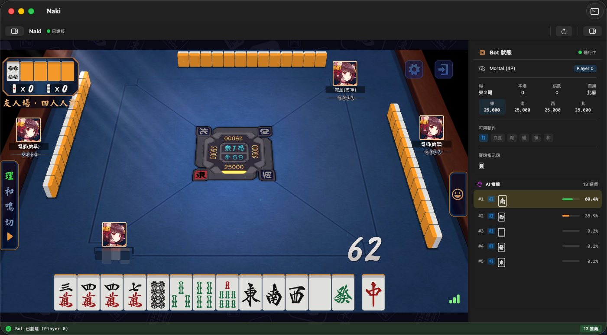
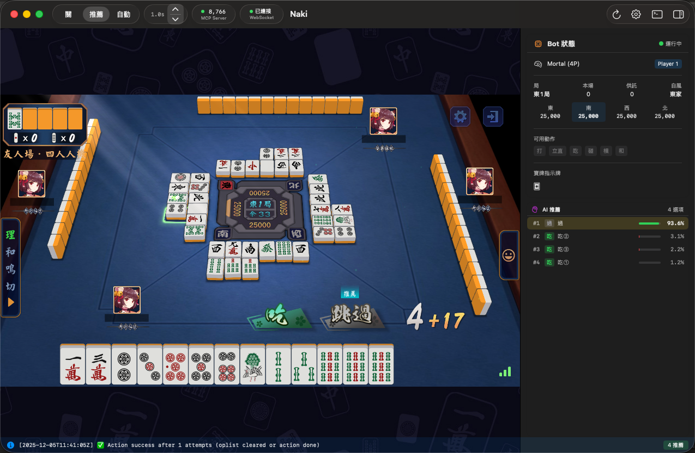
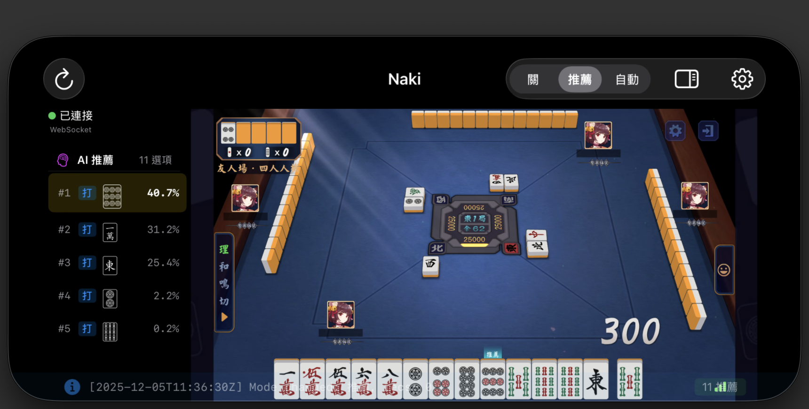

# Naki（鳴き）

**雀魂的 AI 雀友。原生 macOS / iOS 應用，打開就能用。**

<p align="center">
  
</p>

<p align="center">
  
  
  
  
  
</p>

<p align="center">
  <a href="https://github.com/Sunalamye/Naki/releases/latest"><b>下載</b></a> ·
  <a href="#快速開始"><b>快速開始</b></a> ·
  <a href="#能做什麼"><b>能做什麼</b></a> ·
  <a href="#給開發者"><b>給開發者</b></a>
</p>

---

> ## ⚠️ 先讀這段
>
> 本專案**僅供學習與研究**。使用它可能違反雀魂服務條款，導致帳號被封禁。
>
> **請勿使用主帳號。** 作者不對任何損失負責。繼續使用即代表你接受這個風險。

---

## 這是什麼

「鳴き」是日麻術語，指吃、碰、槓那類副露動作。這個 App 會在該鳴的時候告訴你：該鳴。

Naki 把雀魂和麻將 AI 裝進同一個視窗。**不需要 Python、Docker、瀏覽器外掛或代理伺服器**——
下載、打開、登入，AI 推薦就直接疊在遊戲畫面上。

推論引擎是 [Mortal](https://github.com/Equim-chan/Mortal)，透過 Core ML 跑在 Apple Neural Engine 上。
AI 推論不呼叫外部推論服務，模型和運算都在本機；雀魂遊戲本身仍需要網路連線。

---

## 能做什麼

<table>
<tr>
<td width="52%">

### 推薦直接標在牌上

不用低頭看側邊欄再回頭找牌。AI 建議會透過 Unity WebGL hook 標在遊戲畫面；
目前已確認 hook 會執行，但「每次都命中正確牌／按鈕」仍缺視覺回歸測試。

- 動作機會可顯示在原生側欄；遊戲內按鈕染色仍屬 heuristic
- 側邊欄有完整分析與 Q 值
- 涵蓋打牌 / 吃 / 碰 / 槓 / 立直 / 和牌

</td>
<td width="48%">

</td>
</tr>
<tr>
<td width="52%">

</td>
<td width="48%">

### Mac 和 iPhone 都能用

- **macOS** — 支援自動送出；自摸整合仍有下方列出的 P0 缺口
- **iPhone / iPad** — 查看 AI 推薦
- 深色模式、響應式排版

</td>
</tr>
</table>

### 三種模式，隨時切換

| 模式 | 行為 |
|:---:|-----|
| **關閉** | 不自動送動作；目前 AI 仍在背景計算，側欄／WebGL 高亮可能繼續更新 |
| **推薦** | 顯示建議，你自己決定 |
| **自動** | 依 AI／server oplist 自動送出；自摸整合仍有已知 P0 缺口 |

模式會記住，重開 App 不會被重設。

### 其他

- **協定層表情工具** — MCP 可發送表情並讀取收到的廣播；舊自動回覆路徑在 Unity 下不可用
- **隱藏玩家名稱** — 進階設定裡的開關。在遊戲解析封包之前把暱稱改寫成 `Player 1`–`Player 4`，
  不靠任何 UI hook（Unity 客戶端沒有可以 hook 的 UI 層）。只對開啟之後才開始的對局生效；
  斷線重連與終局結算畫面仍會顯示原名
- **MCP Server** — 讓 Claude Code 之類的 AI 助手直接操作遊戲
- **本機 Debug API** — 只綁 loopback，同網段的其他裝置連不到

---

## 快速開始

### 系統需求

| 平台 | 版本 | 架構 |
|-----|------|-----|
| **macOS** | **26.0+** | Apple Silicon |
| **iOS / iPadOS** | 17.0+ | A12 以上 |

> **為什麼要 Apple Silicon？**
> AI 模型跑在 Apple Neural Engine 上，那是 Apple Silicon 獨有的硬體，Intel Mac 沒有。

> **iOS 17–25** 走 `WKWebView` Legacy 路徑，**iOS 26+** 用新的 `WebPage` API。
> 兩條路的決策層現在一致（同一個 resolver），但 Legacy 的 send 失敗不重試，
> 也尚未在實機跑過完整對局。需要自動模式的安全保護時，以 macOS／iOS 26+ 為準。

### 安裝

1. 到 [Releases](https://github.com/Sunalamye/Naki/releases/latest) 下載 `Naki.dmg`
2. 拖進「應用程式」
3. 首次開啟：右鍵 →「打開」（繞過 Gatekeeper）

### 使用

1. 打開 Naki，雀魂會自動載入
2. 登入帳號（**用小號**）
3. 開始對局，推薦即時顯示
4. 在側邊欄選你要的模式

---

## 固定 fixtures 的 AI 輸入 parity 已驗證

這件事值得單獨講，因為它決定推薦到底可不可信。

Mortal 的模型是**固定成品**——它訓練時看到的輸入是一個 `1012 × 34` 的張量，
每一格代表什麼（第 23 格是本場、第 860 格是聽牌…）都寫死在權重裡，改不了。
Naki 這邊如果某一格填錯東西，模型不會報錯，它會**照樣算出一個看起來很正常的推薦**，
只是那個推薦建立在完全錯誤的理解上。

所以 MortalSwift 的 test target 用 libriichi v4 當 oracle：同一串固定對局事件同時餵給
純 Swift encoder 與 Rust oracle，比對 observation 與 action mask。

**目前內建兩套 fixtures 的所有 action-required snapshots 都是 1012 格零落差，
動作遮罩也一致。** 這是有力的回歸證據，但不是所有可能牌局狀態的形式證明。

> 誠實補充：0.5.0 是 2026-08-01 查到的 MortalSwift 最新公開 tag，但它更新的是
> encoder／計算與 parity，bundled 模型權重沒有換。
> Naki 也還沒有千局級評測，所以不能把它稱為「最新最強模型」。

---

## 給開發者

<details>
<summary><b>架構：為什麼不去操作遊戲畫面</b></summary>

```
┌──────────────────────────────────────────────────────────┐
│              WebPage（雀魂 · Unity WebGL）                │
│                          │                               │
│    JavaScript 只做兩件事：收送 WebSocket、替牌上色         │
│              naki-core / naki-websocket                  │
└──────────────────────────┼───────────────────────────────┘
                           ▼
┌──────────────────────────────────────────────────────────┐
│                      Swift 服務層                         │
│                                                          │
│  MajsoulBridge  →  NativeBotController  →  LiqiActionSender
│   (Liqi→MJAI)      (純 Swift + Core ML)      (組包送出)
│                           │                              │
│      AutoPlayDecisionResolver（合法性與模式閘門）          │
│                           │                              │
│          GameStateManager  ←→  SwiftUI Views             │
└──────────────────────────────────────────────────────────┘
```

雀魂目前的客戶端是 Unity WebGL，遊戲邏輯與畫面位於 wasm；
JavaScript 拿不到遊戲內部物件。所以 Naki 一律走**協定層**：
狀態從 WebSocket 封包解析，動作自己組 protobuf 送出。

協定欄位定義取自**遊戲自己公開的資源檔** `res/proto/liqi.json`，不是反組譯客戶端得來的。

畫面高亮則是攔截 WebGL 繪圖呼叫，從 atlas UV 辨識牌種，再暫改該次 draw 的顏色參數；
它不依賴螢幕座標。不過目前只確認 hook 有執行，尚未用 screenshot regression 證明每次都命中正確牌與按鈕。

**合法性應由伺服器決定，不由模型決定。** macOS／iOS 26+ 主路徑已有 resolver：
缺 oplist 時 fail closed、和牌凌駕 AI、其餘動作必須存在於同一份 oplist。
但目前仍有兩個整合缺口：空推薦可能讓自摸完全不進 resolver；hora send 失敗仍可能被
標成 handled。Legacy iOS 17–25 已接上同一個 resolver，但兩者都缺 live 對局驗證，因此「漏自摸已完全消除」仍未驗證。

技術細節：[`docs/majsoul-unity-protocol.md`](docs/majsoul-unity-protocol.md) ·
[`AUDIT.md`](AUDIT.md)

</details>

<details>
<summary><b>Debug API（HTTP，port 8765）</b></summary>

App 啟動後會在本機開一個 HTTP server，`requiredInterfaceType = .loopback`，
只綁 127.0.0.1 / ::1。

```bash
# Bot 狀態、手牌、推薦
curl http://localhost:8765/bot/status

# 協定層目前的可用操作（吃/碰/槓/立直…）
curl http://localhost:8765/bot/ops

# 手動觸發一次自動打牌
curl -X POST http://localhost:8765/bot/trigger

# 在遊戲頁面執行 JS（⚠️ 必須用 return 才有回傳值）
curl -X POST http://localhost:8765/js -d 'return window.location.href'
```

`/status` 會回傳日誌檔路徑；歷史日誌保留最近 5 次啟動。

</details>

<details>
<summary><b>MCP Server（Claude Code 整合）</b></summary>

內建 [Model Context Protocol](https://modelcontextprotocol.io/) server，
**42 個工具**，與 Debug API 共用同一個 port。

```bash
claude mcp add --transport http naki http://localhost:8765/mcp
```

| 類別 | 數量 | 範例 |
|-----|:---:|------|
| 系統 | 4 | `get_status` · `get_logs` |
| Bot 控制 | 7 | `bot_status` · `bot_ops` · `bot_trigger` |
| 遊戲狀態與動作 | 6 | `game_state` · `game_discard` · `game_action` |
| 大廳 | 8 | `lobby_start_match` · `lobby_account_info` |
| 友人房 | 7 | `room_create` · `room_add_robot` · `room_quick_test` |
| 表情 | 2 | `game_emoji` · `game_emoji_listen` |
| 其他 | 8 | JS 執行、防閒置、高亮 |

`room_quick_test` 一次跑完「建房 → 補人機 → 開局」，只負責建立測試局；
客戶端重連、AI 動作、RESPONSE 與權威 action 仍要另行驗證。

> MCP 的 6 個手動高亮工具目前是一律回明確失敗的相容樁；它們沒有接到新的
> `__nakiHighlight`。這與 App 內建的自動 WebGL 高亮是兩條不同路徑。

</details>

<details>
<summary><b>自己建置</b></summary>

需要 Xcode 26 以上。

```bash
git clone https://github.com/Sunalamye/Naki.git
cd Naki
xcodebuild build -project Naki.xcodeproj -scheme Naki
xcodebuild test  -project Naki.xcodeproj -scheme Naki -only-testing:NakiTests
```

**實際打牌請用 Release 建置。** Core ML 與期望值計算會受最佳化設定影響；
本次盤點沒有重跑延遲 benchmark，因此不保留舊的固定毫秒數。
Xcode 裡可到 `Product → Scheme → Edit Scheme → Run → Build Configuration` 調整。

</details>

---

## 現況

| | 狀態 |
|---|---|
| AI encoder fixture parity | ✅ 兩套固定 fixtures 逐格一致 |
| live AI 推薦資料 | ✅ `bot_status`／`game_hand` 有 runtime 證據 |
| 原生側欄視覺呈現 | ⚠️ source binding 已確認；本次沒有 screenshot regression |
| 全自動打牌 | ⚠️ discard／pon／riichi／ron 有 runtime 證據；自摸整合仍有 P0 缺口 |
| WebGL 牌面／動作按鈕高亮 | ⚠️ hook 活性已確認；視覺命中尚未驗證 |
| MCP Server | ✅ live registry 為 42 tools |
| 表情協定收送 | ⚠️ 現行 tools／Liqi 路徑存在；本次未做 live 收送 round-trip |
| iOS 17–25 相容路徑 | ⚠️ 只驗過編譯與單元測試，未實機跑過對局 |
| 三麻 | ❌ 見下 |
| 牌譜回放分析 | ❌ 尚未開始 |

### 關於三麻

Naki repo 目前沒有三麻 constructor、encoder 或 bundled 權重。
三麻對局時仍會建立同一個 Mortal v4 四麻模型——輸入結構根本不同，
輸出不是「稍微偏差」而是**結構上無效**。因此 UI 會明確標示
`Mortal (4P) ⚠️ 三麻無專用模型`，不會假裝有支援。

---

## 致謝

- [Mortal](https://github.com/Equim-chan/Mortal) — 麻將 AI 引擎與 libriichi
- [Akagi](https://github.com/shinkuan/Akagi) — Python 版參考實現
- 雀魂（Majsoul） — 很好的麻將遊戲

---

## 許可證

[AGPL-3.0 with Commons Clause](LICENSE) — 開源，但**禁止商業銷售**。

---

## ⚖️ 免責聲明

**開發目的**：學習 Swift / SwiftUI 原生開發、Core ML 模型整合、
WebSocket 與 Protobuf 協定解析。

**帳號風險**：使用本工具可能違反雀魂服務條款，可能導致帳號被暫停或永久封禁。
**強烈建議使用小號。**

**法律風險**：某些地區使用此類工具可能涉及法律問題，請自行確認當地法規。

**無擔保**：本軟體按「現狀」提供，不提供任何明示或暗示的擔保。
作者不對任何索賠、損害或其他責任負責。

**第三方**：雀魂是貓糧工作室的註冊商標；本專案與貓糧工作室、悠星網絡無任何關聯。

使用本軟體即表示你已閱讀、理解並同意以上條款。

---

<p align="center">
  <a href="https://star-history.com/#Sunalamye/Naki&Date">
    
  </a>
</p>
